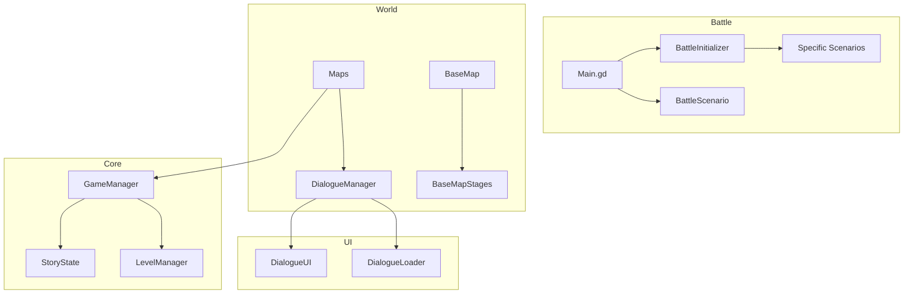

# SekaiRPG: Project Architecture & Dependency Map

Tài liệu này mô tả cấu trúc hệ thống của SekaiRPG sau đợt Refactor lớn sang kiến trúc **Domain-Driven** và **Scenario-based**.

## 1. Core Engine (Bộ não trung tâm)

| File | Chức năng chính | Phụ thuộc vào |
| :--- | :--- | :--- |
| **`GameManager.gd`** (Autoload) | Quản lý trạng thái toàn cục: Party, Save/Load, Scene Transition. | `StoryState`, `LevelManager` |
| **`StoryState.gd`** | Lưu trữ các cờ (flags) kịch bản và tiến độ nhiệm vụ. | Không có |
| **`LevelManager.gd`** | Xử lý EXP, Stats và công thức thăng cấp. | `Entity` |

## 2. Battle System (Hệ thống chiến đấu)

Hệ thống này được thiết kế theo kiểu "Engine & Hooks".

| File | Chức năng chính | Phụ thuộc vào |
| :--- | :--- | :--- |
| **`Main.gd`** | Battle Engine. Điều phối vòng lặp lượt đánh, AI, và UI trận đấu. | `BattleScenario`, `BattleHUD` |
| **`BattleInitializer.gd`** | Khởi tạo dữ liệu đội hình và chọn Scenario phù hợp trước trận. | `GameManager`, `Scenarios` |
| **`BattleScenario.gd`** | Lớp cơ sở (Abstract) định nghĩa các hooks (on_start, on_turn,...). | `Main.gd` |
| **`DefaultScenario.gd`** | Logic chiến đấu mặc định (đánh đến khi hết máu). | `GameManager` |
| **`AIManager.gd`** | Tính toán mục tiêu và kỹ năng cho kẻ địch. | `Entity` |

## 3. Dialogue System (Hệ thống hội thoại)

Tuân thủ mô hình **MVC (Model-View-Controller)**.

| File | Chức năng chính | Phụ thuộc vào |
| :--- | :--- | :--- |
| **`DialogueManager.gd`** (Controller) | Điều phối luồng thoại, xử lý Callback khi hết thoại. | `DialogueUI`, `DialogueLoader` |
| **`DialogueUI.gd`** (View) | Vẽ giao diện khung thoại, chân dung, hiệu ứng chữ. | Không có |
| **`DialogueLoader.gd`** (Model) | Nạp dữ liệu hội thoại từ bộ nhớ/JSON. | Không có |

## 4. World & Maps (Hệ thống bản đồ)

Sử dụng **Stage Pattern** để quản lý kịch bản theo địa điểm.

| File | Chức năng chính | Phụ thuộc vào |
| :--- | :--- | :--- |
| **`BaseMap.gd`** (Shell) | Vẽ kiến trúc Safehouse, spawn NPC, điều phối kịch bản. | `BaseMapStage`, `GameManager` |
| **`BaseMapStage.gd`** | Interface cho các giai đoạn tại Safehouse. | `BaseMap.gd` |
| **`Stages/IntroStage.gd`** | Kịch bản làm quen ban đầu. | `BaseMap.gd`, `DialogueManager` |
| **`Stages/PostHarborStage.gd`**| Kịch bản sau trận Boss (Mizuki Phase). | `BaseMap.gd`, `DialogueManager` |
| **`HarborMap.gd`** | Bản đồ Bến cảng, quản lý các Trigger chiến đấu. | `HarborBossScenario` |
| **`PrologueMap.gd`** | Bản đồ mở đầu, quản lý Tutorial. | `PrologueScenario` |

## 5. Entities (Thực thể)

| File | Chức năng chính | Phụ thuộc vào |
| :--- | :--- | :--- |
| **`Entity.gd`** | Base class cho nhân vật/quái vật (Stats, Skills, Cooldowns). | Không có |
| **`Character Scripts`** | Định nghĩa chỉ số và kỹ năng riêng (Ichika.gd, Kanade.gd,...). | `Entity.gd` |

---

## Sơ đồ phụ thuộc (Dependency Flow)

---

**Ghi chú cho lập trình viên:**
*   Khi muốn thêm **Nhiệm vụ mới tại BaseMap**: Chỉ cần tạo script mới kế thừa `BaseMapStage` và đăng ký vào `BaseMap.gd`.
*   Khi muốn thêm **Boss mới**: Tạo Scenario mới kế thừa `BattleScenario` và gọi nó thông qua `BattleInitializer`.
*   Khi muốn sửa **Giao diện hội thoại**: Chỉ sửa file `DialogueUI.gd`, logic điều phối thoại sẽ không bị ảnh hưởng.
