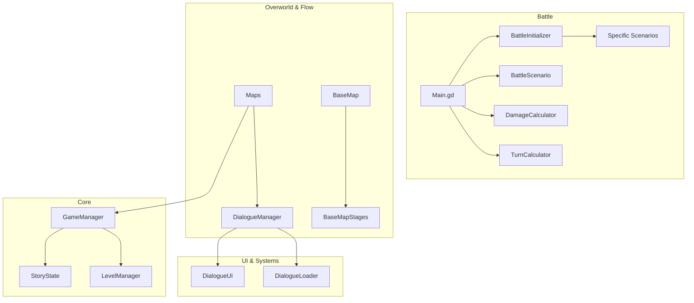

# SekaiRPG: Project Architecture & Dependency Map

Tài liệu này cung cấp cái nhìn tổng quan về kiến trúc của **SekaiRPG**, được thiết kế theo mô hình **Domain-Driven** và **Scenario-based**, giúp các lập trình viên dễ dàng mở rộng và bảo trì hệ thống.

---

## 1. Core Engine (Bộ não trung tâm)

Chịu trách nhiệm quản lý trạng thái toàn cục của trò chơi, bao gồm tiến trình cốt truyện, đội hình và dữ liệu lưu trữ.

| File | Chức năng chính | Phụ thuộc vào |
| :--- | :--- | :--- |
| **`GameManager.gd`** (Autoload) | Quản lý trạng thái toàn cục (Party, Save/Load, Scene Transition). Điều phối các `Scripted Battle`. | `StoryState`, `LevelManager` |
| **`StoryState.gd`** | Lưu trữ các cờ (flags) kịch bản và tiến độ nhiệm vụ (wave, quest). | Không có |
| **`LevelManager.gd`** | Xử lý nhận EXP, tính toán chỉ số theo cấp độ (Soft/Hard Cap), và tự động phân bổ chỉ số (Auto-upgrade) cho quái vật. | `Entity` |

---

## 2. Battle System (Hệ thống chiến đấu)

Hệ thống chiến đấu theo lượt (Turn-based) phức tạp sử dụng cơ chế **Action Value (AV)** (tương tự Honkai: Star Rail).

### 2.1. Battle Engine (Lõi chiến đấu)
| File | Chức năng chính | Phụ thuộc vào |
| :--- | :--- | :--- |
| **`Main.gd`** | Battle Engine cốt lõi. Quản lý Vòng lặp lượt đánh, AI, Timeline (AV), và UI trận đấu. | Nhiều hệ thống |
| **`BattleInitializer.gd`** | Tự động đọc Map/Kịch bản để khởi tạo đội hình Phe ta - Phe địch và chọn Scenario phù hợp trước trận. | `GameManager`, `Scenarios` |
| **`AIManager.gd`** | Trí tuệ nhân tạo của kẻ địch. Tính toán mục tiêu (Tanker, Low HP) và ra quyết định dùng kỹ năng. | `Entity` |

### 2.2. Battle Mechanics (Cơ chế tính toán)
| File | Chức năng chính | Phụ thuộc vào |
| :--- | :--- | :--- |
| **`DamageCalculator.gd`** | Tính toán sát thương, bao gồm Buff, Debuff, và Tương khắc hệ (Cool, Pure, v.v.). | `Entity` |
| **`TurnCalculator.gd`** | Tính toán Action Value (AV) dựa trên Tốc độ (Speed) và hành động để xác định thứ tự lượt đánh. | `Entity` |
| **`ProcessStatus.gd`** | Xử lý logic tại đầu/cuối lượt (Trừ máu do Bleed/Poison, giảm Cooldown, Stun). | `Entity` |

### 2.3. Scenarios (Kịch bản chiến đấu)
Hệ thống sử dụng **Scenario Pattern** để can thiệp vào các "Hooks" của trận đấu (on_start, on_turn_start, on_entity_died).
| File | Chức năng chính |
| :--- | :--- |
| **`BattleScenario.gd`** | Lớp cơ sở (Abstract) định nghĩa các hooks chiến đấu. |
| **`DefaultScenario.gd`** | Logic chiến đấu mặc định (Đánh đến khi một bên hết máu). |
| **`HarborBossScenario.gd`**| Kịch bản phức tạp 3 Phase của trận Đội Trưởng (Cảng), hồi sinh, đổi team. |
| **`PrologueScenario.gd`** | Kịch bản trận mở màn (Ichika bị bao vây). |

---

## 3. Dialogue System (Hệ thống hội thoại)

Tuân thủ chặt chẽ mô hình **MVC (Model-View-Controller)**, tách biệt hoàn toàn giữa dữ liệu, hiển thị và logic.

| File | Vai trò | Chức năng chính |
| :--- | :--- | :--- |
| **`DialogueManager.gd`** | **Controller** | Điều phối luồng thoại, block input, gọi Callback sự kiện sau khi hết thoại. |
| **`DialogueUI.gd`** | **View** | Vẽ giao diện khung thoại, chân dung NPC, hiệu ứng gõ chữ (Typewriter effect). |
| **`DialogueLoader.gd`** | **Model** | Nạp và phân tích dữ liệu hội thoại từ bộ nhớ hoặc file JSON. |

---

## 4. World & Maps (Hệ thống bản đồ)

Quản lý không gian Overworld và luồng di chuyển của người chơi. Safehouse sử dụng **Stage Pattern** để thay đổi không gian theo thời gian thực mà không cần đổi Scene.

| File/Thư mục | Chức năng chính | Trạng thái (Story) |
| :--- | :--- | :--- |
| **`PrologueMap.gd`** | Bản đồ mở đầu. Quản lý kịch bản Ichika bị bao vây và Mafuyu cứu viện. | Tutorial |
| **`BaseMap.gd`** (Shell)| Vỏ bọc Safehouse. Chứa BaseMapStage để thay đổi ánh sáng, NPC tùy tiến độ. | Hub/Safehouse |
| **`WarehouseMap.gd`** | Bản đồ Nhà kho. Đánh theo dạng Wave liên tục. | Nhiệm vụ phụ |
| **`HarborMap.gd`** | Bản đồ Bến cảng. Quản lý đường đi (Đánh lính gác hoặc vào thẳng Boss). | Nhiệm vụ chính |
| **`AlleywayMap.gd`** | Bản đồ Hẻm nhỏ. Trạm dừng chân sau nhiệm vụ Bến cảng. | Transition |

---

## 5. Entities (Thực thể & Chỉ số)

Thiết kế theo mô hình Hướng đối tượng (OOP). Mỗi nhân vật hoặc kẻ địch kế thừa từ một Base Class thống nhất.

### 5.1. Base Class
| File | Chức năng chính |
| :--- | :--- |
| **`Entity.gd`** | Nền tảng của vạn vật. Quản lý Stats (HP, ATK, SPD, DEF), Mảng Kỹ năng (Skills), Buffs/Debuffs (Status), và Hệ (Elements). |

### 5.2. Characters (Phe ta)
Các script nằm trong `Entities/Characters/`. Mỗi nhân vật (Ichika, Mafuyu, Ena, v.v.) có kỹ năng, chỉ số Hard Cap và cơ chế tương tác (Synergy) riêng biệt (VD: Ichika & Mafuyu tương tác với Bleed).

### 5.3. Enemies (Kẻ địch)
Các script nằm trong `Entities/Enemies/`.
*   **`Kidnapper.gd`**: Kẻ thù cơ bản ở Prologue.
*   **`Guard.gd` / `Captain.gd`**: Lính gác và Boss Đội trưởng tại Bến cảng.
*   **`WarehouseWorker.gd`**: Quái vật ở Nhà kho.
*   **`TrainingBot.gd`**: Dùng cho chế độ Sandbox/Training.

---

## Sơ đồ phụ thuộc (Dependency Flow)

---

## Hướng dẫn mở rộng cho Developer

1.  **Thêm Nhân vật / Kẻ địch mới**:
    *   Tạo script mới kế thừa `Entity.gd` trong thư mục `Entities/`.
    *   Định nghĩa Base Stats, Element và danh sách Kỹ năng (Skills array).
    *   Đăng ký Class mới vào từ điển `character_classes` hoặc `enemy_classes` trong `BattleInitializer.gd`.

2.  **Thêm Trận đánh Boss (Scripted Battle)**:
    *   Tạo file Scenario mới trong `Scripts/Battle/Scenarios/` (kế thừa `BattleScenario.gd`).
    *   Cập nhật `BattleInitializer.gd` (hàm `_setup_scripted_battle`) để trả về Scenario này cùng với đội hình tương ứng.
    *   Gọi `GameManager.is_scripted_battle = true` trước khi trigger trận.

3.  **Thêm Kịch bản tại Safehouse**:
    *   Tạo file Stage mới trong `Maps/Base/Stages/` (kế thừa `BaseMapStage`).
    *   Ghi đè các hàm như `get_npc_positions()`, `on_stage_start()` để đặt logic.
    *   Đăng ký Stage vào `BaseMap.gd`.
