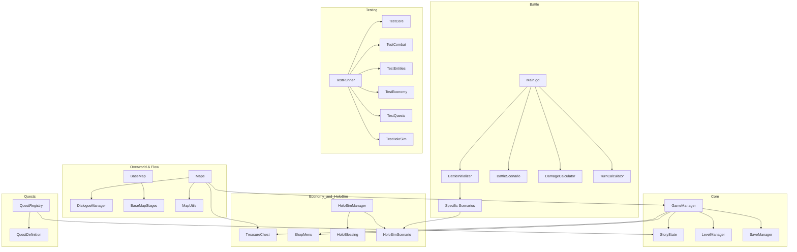

# SekaiRPG: Project Architecture & Dependency Map

Tài liệu này cung cấp cái nhìn tổng quan về kiến trúc của **SekaiRPG**, được thiết kế theo mô hình **Domain-Driven** và **Scenario-based**, giúp các lập trình viên dễ dàng mở rộng và bảo trì hệ thống.

---

## 0. Cấu Trúc Thư Mục Tinh Gọn (Clean Directory Tree)

Dự án đã được tổ chức lại tinh gọn thành **9 thư mục cốt lõi**, loại bỏ triệt để tình trạng phân mảnh, trùng lặp tài nguyên:

```text
SekaiRPG/
├── Assets/                    # Toàn bộ tài nguyên nghe nhìn
│   ├── Audio/                 # Nhạc nền (BGM mp3)
│   ├── Fonts/                 # Phông chữ hệ thống (zhcn.ttf, #9Slide03...)
│   ├── Icons/                 # Biểu tượng trạng thái, skill
│   ├── Indoors/               # Gạch ngói nội thất nhà cửa
│   ├── Person/                # Texture nhân vật legacy
│   ├── Portraits/             # Chân dung nhân vật hội thoại (256x256)
│   ├── Roads/                 # Gạch ngói đường xá
│   ├── Sprites/               # Sprite sheet SVG hoạt họa 3x4, rương kho báu
│   ├── kenney_micro-roguelike/# Tilemap gạch ngói môi trường
│   └── kenney_ui-pack-adventure/ # Vector UI buttons, panels, minimap
├── Data/                      # Cấu hình dữ liệu ngoài (JSON)
│   ├── battles/               # Cấu hình đội hình trận đấu nhiệm vụ
│   └── storyline/             # Toàn bộ kịch bản hội thoại theo chương
├── Entities/                  # Mô hình thực thể hướng đối tượng (OOP)
│   ├── Characters/            # 6 nhân vật chơi được (Ichika, Kanade, Mafuyu, Ena, Mizuki, Honami)
│   ├── Enemies/               # 8 chủng loại quái vật và Boss
│   └── Entity.gd              # Base class thực thể toàn diện
├── Export/                    # Cấu hình và tệp xuất bản (PC, Android)
├── Maps/                      # Không gian Overworld & kịch bản khám phá
│   ├── Base/                  # Safehouse Hub & các BaseMapStage theo thời gian
│   ├── Prologue/              # Hẻm mở màn
│   ├── Warehouse/             # Nhà kho bỏ hoang (Wave battles)
│   ├── Harbor/                # Bến cảng bí mật (Boss Đội Trưởng)
│   ├── Cafe/                  # Quán Cafe nội đô
│   ├── Street/                # Ngã tư đường phố (Street survival)
│   ├── HonamiHouse/           # Phòng khám tư nhân của Honami
│   ├── CityOperations/        # Chiến dịch chia cắt lực lượng
│   └── Highway/               # Xa lộ đêm & Boss Thủ Tướng
├── Quests/                    # Lớp siêu dữ liệu nhiệm vụ (Quest-driven Architecture)
│   ├── Definitions/           # 10 Resource .tres cấu hình nhiệm vụ
│   ├── QuestDefinition.gd     # Lớp định nghĩa siêu dữ liệu Quest
│   └── QuestRegistry.gd       # Trình quản lý và tra cứu tiến trình nhiệm vụ
├── Scripts/                   # Logic mã nguồn hệ thống
│   ├── Battle/                # Main.gd, BattleScene.tscn, Scenarios/, HoloSim/, Calculators
│   ├── Core/                  # GameManager.gd, SaveManager.gd, StoryState.gd
│   ├── Overworld/             # OverworldPlayer.gd, MapUtils.gd, TreasureChest.gd, InteractableZone.gd
│   └── Systems/               # AudioManager.gd, LevelManager.gd, DialogueLoader.gd
├── Tests/                     # Hệ thống kiểm thử tự động toàn diện (Unit Test Suite)
│   ├── Unit/                  # TestCore, TestCombat, TestEntities, TestEconomy, TestQuests, TestHoloSim
│   ├── BaseTest.gd            # Base test class với assertions & tracking
│   ├── TestRunner.gd          # Master test coordinator & formatted report
│   └── TestRunnerScene.tscn   # Scene thực thi test runner
└── UI/                        # Toàn bộ giao diện người dùng
    ├── Battle/                # CharacterCard, CommandMenu, FloatingText, TimelineUI
    ├── Effects/               # ScreenFade, ScreenShake
    ├── HoloSim/               # HoloBlessingSelectUI (Chọn 3 thẻ bài Phước Lành)
    ├── Menus/                 # StartMenu, SaveLoadMenu, SandboxMenu
    ├── Popups/                # SkillDetailPopup, TargetSelector
    └── Systems/               # DialogueUI, MobileControls, PauseMenu, ShopMenu, UpgradeUI
```

---

## 1. Core Engine (Bộ não trung tâm)

Chịu trách nhiệm quản lý trạng thái toàn cục của trò chơi, bao gồm tiến trình cốt truyện, đội hình, kinh tế và dữ liệu lưu trữ.

| File | Chức năng chính | Phụ thuộc vào |
| :--- | :--- | :--- |
| **`GameManager.gd`** (Autoload) | Quản lý trạng thái toàn cục (Party, Scene Transition). Điều phối các `Scripted Battle`, quản lý số dư `credits`, túi đồ `inventory`, ghi nhận rương `opened_chests`, bộ đếm Auto-save an toàn (5 phút), và xử lý Game Over. | `StoryState`, `LevelManager`, `SaveManager` |
| **`SaveManager.gd`** | Quản lý lưu trữ chuyên biệt tại `user://saves/`, tự động đóng gói siêu dữ liệu (Quest Name, Map Name, Timestamp, Version), quản lý Quick Save, Auto-Save, lưu trữ trọn vẹn cả Party Stats, Credits, Inventory, Chest States. | `StoryState`, `QuestRegistry` |
| **`StoryState.gd`** | Lưu trữ các cờ (flags) kịch bản và tiến độ nhiệm vụ (wave, quest). | Không có |
| **`LevelManager.gd`** | Xử lý nhận EXP, tính toán chỉ số theo cấp độ (Soft/Hard Cap), và tự động phân bổ chỉ số (Auto-upgrade) cho quái vật. | `Entity` |

---

## 2. Battle System (Hệ thống chiến đấu 2.0)

Hệ thống chiến đấu theo lượt (Turn-based) chuyên sâu sử dụng cơ chế **Action Value (AV)** kết hợp cơ chế điểm yếu và chí mạng.

### 2.1. Battle Engine (Lõi chiến đấu)
| File | Chức năng chính | Phụ thuộc vào |
| :--- | :--- | :--- |
| **`Scripts/Battle/Main.gd`** | Battle Engine cốt lõi. Quản lý Vòng lặp lượt đánh, AI, Timeline (AV), hiệu ứng rung chấn ScreenShake, dừng hình Hitstop, sử dụng vật phẩm và tiền thưởng hạ gục địch. | Nhiều hệ thống |
| **`Scripts/Battle/BattleInitializer.gd`** | Tự động đọc Map/Kịch bản hoặc trạng thái HoloSim để khởi tạo đội hình Phe ta - Phe địch và chọn Scenario phù hợp trước trận. | `GameManager`, `Scenarios`, `HoloSimManager` |
| **`Scripts/Battle/AIManager.gd`** | Trí tuệ nhân tạo của kẻ địch. Tính toán mục tiêu (Tanker, Low HP) và ra quyết định dùng kỹ năng dựa trên Timeline dự báo. | `Entity` |

### 2.2. Battle Mechanics & Depth (Tính toán chiến đấu nâng cao)
| File | Chức năng chính | Phụ thuộc vào |
| :--- | :--- | :--- |
| **`DamageCalculator.gd`** | Tính toán sát thương chi tiết `calculate_damage_detailed`: Buff, Debuff, Tương khắc hệ (TypeChart), tỷ lệ và sát thương **Chí Mạng (Critical Hit)**, bào mòn **Thanh Điểm Yếu (Break Gauge)**, kích hoạt **Weakness Break** (Trễ 3000 AV + Choáng 1 lượt). | `Entity`, `TypeChart` |
| **`TurnCalculator.gd`** | Tính toán Action Value (AV) dựa trên Tốc độ (Speed) và hành động để xác định thứ tự lượt đánh. | `Entity` |
| **`ProcessStatus.gd`** | Xử lý logic tại đầu/cuối lượt (Trừ máu do Bleed/Poison, giảm Cooldown, Stun, Buffs). | `Entity` |

### 2.3. Scenarios (Kịch bản chiến đấu)
Nằm tập trung tại thư mục `Scripts/Battle/Scenarios/`:
| File | Chức năng chính |
| :--- | :--- |
| **`BattleScenario.gd`** | Lớp cơ sở (Abstract) định nghĩa các hooks chiến đấu (`on_start`, `on_turn_start`, `on_entity_died`, `on_battle_completed`). |
| **`DefaultScenario.gd`** | Logic chiến đấu mặc định (Đánh đến khi một bên hết máu). |
| **`HarborBossScenario.gd`**| Kịch bản phức tạp 3 Phase của trận Đội Trưởng (Cảng), hồi sinh, đổi team. |
| **`PrologueScenario.gd`** | Kịch bản trận mở màn (Ichika bị bao vây). |
| **`StreetSurvivalScenario.gd`** | Kịch bản sinh tồn đặc biệt: Khóa kỹ năng, quái spawn vô hạn tăng cấp dần, pha Cứu viện của Mafuyu. |
| **`PrimeMinisterBossScenario.gd`** | Trận Boss cuối Xa Lộ, gọi đệ bắn tỉa diện rộng và khóa quyền bính. |
| **`HoloSimScenario.gd`** | Kịch bản mô phỏng Roguelite: Kích hoạt hiệu ứng Phước Lành (Thorns phản đòn, Bleed, Hồi sinh Undying), mở giao diện chọn thẻ bài sau chiến thắng tầng. |

### 2.4. Bảng Tương Khắc Hệ & Cơ Chế Phá Vỡ Điểm Yếu (Elements & Weakness Break)

Mọi nhân vật và **100% kẻ địch trong SekaiRPG đều sở hữu một thuộc tính nguyên tố** thuộc ngũ hành:

```text
       ┌────────── Cool ──────────┐
       ▼                          │ (khắc)
     Happy ◄──────── Cute ◄───────┘
```
- **Hệ Vòng Tròn 3 Cạnh**: `Cool` khắc `Happy` (x1.25) -> `Happy` khắc `Cute` (x1.25) -> `Cute` khắc `Cool` (x1.25).
- **Hệ Đối Lập Nhị Cực**: `Pure` và `Mysterious` khắc chế lẫn nhau (x1.25).

#### Quy tắc Phá Điểm Yếu (Break Rules):
1. **Đánh trúng hệ yếu (Weakness Hit - x1.25)**: Bào mòn cực mạnh thanh Break Gauge (`int(dmg * 0.4) + 25`, x2 nếu có Phước Lành Chấn Lực).
2. **Đánh trung tính (Neutral Hit - x1.0)**: Vẫn bào mòn điểm yếu ở mức độ vừa phải (`int(dmg * 0.15) + 10`), đảm bảo ngay cả khi không có nhân vật khắc hệ vẫn có thể tích lũy làm choáng kẻ địch.
3. **Khi Break Gauge về 0 (Weakness Break)**: Kẻ địch lập tức bị **Choáng (Stun 1 lượt)** và bị **đẩy lùi 3000 Action Value** trên thanh thời gian!

### 2.5. Danh Mục Kẻ Địch (12 Enemy Archetypes)

| Kẻ Địch | Hệ (Element) | Điểm Yếu (Khắc bởi) | Vai trò & Kỹ năng nổi bật |
| :--- | :--- | :--- | :--- |
| **`Kidnapper`** | `Happy` | `Cool` (Kanade) | Du côn mở màn, đâm lén gây sát thương cơ bản. |
| **`Thug`** | `Happy` | `Cool` (Kanade) | Giang hồ quán cafe, chém ngang đơn mục tiêu. |
| **`CyberJammer`** [MỚI] | `Happy` | `Cool` (Kanade) | Chuyên viên nhiễu sóng: Hack gây Stun 1 lượt, overclock buff 25 ATK và 3000 AV cho đồng minh. |
| **`WarehouseWorker`** | `Cool` | `Cute` (Mizuki) | Công nhân nhà kho, ném cờ-lê gây choáng. |
| **`ReconDrone`** [MỚI] | `Cool` | `Cute` (Mizuki) | Drone trinh sát cơ động: SPD cực cao (140), quét giảm 25 DEF, phóng xung EMP đẩy lùi 2500 AV. |
| **`Terrorist`** | `Cute` | `Happy` (Ena) | Khủng bố đường phố, xả súng liên thanh gây tích dồn Bleed. |
| **`CyborgEnforcer`** [MỚI] | `Cute` | `Happy` (Ena) | Vệ binh cơ giới giáp thép: Chống chịu cao (500 HP, 60 DEF, 180 Break Gauge), Nện khiên gây Stun, Bật khiên hồi 80 HP. |
| **`Guard`** | `Mysterious` | `Pure` (Ichika, Honami) | Lính gác bến cảng, chém gươm phòng thủ. |
| **`Captain`** (Boss) | `Mysterious` | `Pure` (Ichika, Honami) | Trùm bến cảng, lệnh xử tử sát thương diện rộng. |
| **`Sniper`** [MỚI] | `Mysterious` | `Pure` (Ichika, Honami) | Xạ thủ bắn tỉa ngầm: Crit Rate 35%, Headshot chí mạng x2.0 kèm 2 stack Bleed, ném Lựu đạn khói buff DEF. |
| **`TrainingBot`** | `Mysterious` | `Pure` (Ichika, Honami) | Robot huấn luyện sandbox. |
| **`PrimeMinister`** (Final Boss) | `Pure` | `Mysterious` (Mafuyu) | Trùm cuối giả tạo: 12000 HP, 500 Break Gauge, gọi bắn tỉa diện rộng và khóa quyền bính làm choáng. |

---

## 3. Exploration, Economy & Items (Khám phá & Kinh tế)

Hệ thống bổ trợ giúp người chơi có mục tiêu khám phá các bản đồ và quản lý tài nguyên:

| File | Chức năng chính |
| :--- | :--- |
| **`Scripts/Overworld/TreasureChest.gd`** | Rương kho báu tương tác trong Overworld. Tự động chuyển đổi sprite rương đóng/mở (`chest_closed.svg` / `chest_open.svg`), thưởng Credits và vật phẩm, lưu trạng thái mở vĩnh viễn theo `chest_id`. |
| **`UI/Systems/ShopMenu.gd`** | Giao diện máy bán hàng tự động tại Safehouse. Người chơi dùng Credits mua Bình máu, Nước tăng lực, Băng cứu thương. |
| **`UI/Battle/CommandMenu.gd`** | Tích hợp nút **`[VẬT PHẨM]`** vào menu chiến đấu, cho phép dùng vật phẩm hỗ trợ đồng đội trong lượt đi. |

---

## 4. Holo-Simulation Roguelite Mode (Chế độ Leo Tháp 10 Tầng)

Chế độ chơi lại vô tận (Endless / Roguelite Mode) có thể truy cập từ máy tính tại căn cứ Safehouse:

| Thành phần | File | Chức năng |
| :--- | :--- | :--- |
| **Trình điều phối** | `Scripts/Battle/HoloSim/HoloSimManager.gd` (Autoload) | Quản lý tiến trình 10 tầng thử thách, danh sách Phước Lành đã nhặt, lưu High Score. |
| **Danh mục Phước Lành** | `Scripts/Battle/HoloSim/HoloBlessing.gd` | 8 Phước Lành Roguelite: Huyết Nguyệt (Bleed), Tốc Hành (SPD), Tâm Nhãn (Crit), Kích Nổ (Giảm CD), Giáp Gai (Thorns), Chấn Lực (Break x2), Hấp Thu (Hồi máu khi kill), Bất Tử (Hồi sinh 1 lần). |
| **Giao diện chọn bài** | `UI/HoloSim/HoloBlessingSelectUI.gd` | Hiển thị 3 thẻ bài ngẫu nhiên để người chơi chọn sau mỗi tầng thắng. |
| **Trạm nghỉ ngơi** | Tầng 4 & Tầng 9 | Tự động hồi phục 50% HP toàn đội + tặng 150 Credits. |
| **Trùm Cuối** | Tầng 10 | Trận quyết đấu với Super Captain Boss Lv.35 nhận thưởng 1000 Credits. |

---

## 5. Quests & Missions (Hệ thống Nhiệm vụ & Siêu dữ liệu)

Để tổ chức codebase theo hướng dễ tra cứu và bảo trì theo nhiệm vụ (Quest-driven) thay vì chỉ theo địa điểm vật lý, hệ thống cung cấp lớp siêu dữ liệu (Metadata Resource) tại thư mục `res://Quests/`.

| File / Thư mục | Chức năng chính | Phụ thuộc vào |
| :--- | :--- | :--- |
| **`QuestDefinition.gd`** | Lớp Resource định nghĩa cấu trúc dữ liệu cho một nhiệm vụ: ID, Tên, Arc, Scene bản đồ liên kết (`linked_map_scene`), Entry Stage, Scenario chiến đấu, Dialogue file, và điều kiện StoryState trước/sau. | `Resource` |
| **`QuestRegistry.gd`** | Tiện ích tĩnh cung cấp API nạp và tra cứu danh sách toàn bộ nhiệm vụ (`get_all_quests`), tra cứu theo ID (`get_quest`), và tự động xác định nhiệm vụ hiện tại dựa trên cờ StoryState (`get_current_quest`). | `QuestDefinition`, `StoryState` |
| **`Quests/Definitions/*.tres`** | 10 tài nguyên Resource tương ứng với 10 nhiệm vụ cốt truyện từ Prologue đến Finale. | `QuestDefinition` |

---

## 6. Automated Unit Testing Framework (Hệ Thống Kiểm Thử Tự Động)

Dự án trang bị bộ Unit Test chuẩn chỉ, phân tách rõ ràng theo module tại `Tests/Unit/`. Sau này khi thêm tính năng, lập trình viên chỉ cần thêm test method vào module tương ứng:

```text
Tests/
├── Unit/
│   ├── BaseTest.gd       # Base class cung cấp assert_true, assert_false, assert_eq, assert_gt, assert_lt
│   ├── TestCore.gd       # Test GameManager flags, StoryState serialization, LevelManager EXP, SaveManager CRUD
│   ├── TestCombat.gd     # Test DamageCalculator, TypeChart, Crits, Weakness Break, AV, ProcessStatus, AIManager
│   ├── TestEntities.gd   # Test 6 Characters, skills, passives (Honami, Kanade), 8 Enemy classes
│   ├── TestEconomy.gd    # Test Credits, Inventory add/use/cleanse, TreasureChests persistence
│   ├── TestQuests.gd     # Test QuestRegistry load 10 quests, progression mapping
│   └── TestHoloSim.gd    # Test HoloSim 10 floors, 8 blessings, rest stations, scenario flow
├── TestRunner.gd         # Trình điều phối master runner, xuất bảng báo cáo console
└── TestRunnerScene.tscn  # Scene thực thi kiểm thử
```

### Cách chạy kiểm thử:
```bash
godot --headless Tests/TestRunnerScene.tscn
```
- Nếu toàn bộ test case đạt: Console xuất báo cáo chi tiết và thoát với **Exit Code 0**.
- Nếu có bất kỳ test nào thất bại: Console chỉ rõ file, dòng lỗi, giá trị mong đợi và thoát với **Exit Code 1** (tối ưu cho CI/CD).

### Cách thêm bài test mới:
Chỉ cần mở file module tương ứng trong `Tests/Unit/` (ví dụ `TestCombat.gd`) và viết thêm hàm bắt đầu bằng `test_`:
```gdscript
func test_new_combat_feature():
    var result = my_new_calculation()
    assert_gt(result, 100, "Kết quả tính toán phải vượt mức 100")
```
Bộ điều phối `TestRunner` sẽ tự động phát hiện và thực thi hàm test mới mà không cần đăng ký thủ công!

---

## 7. Sơ đồ phụ thuộc tổng thể (Dependency Flow)


```mermaid
graph TD
    subgraph Core
        GM[GameManager] --> SS[StoryState]
        GM --> LM[LevelManager]
        GM --> SManager[SaveManager]
    end

    subgraph Economy_and_HoloSim
        GM --> TC_Chest[TreasureChest]
        GM --> SM_Shop[ShopMenu]
        HSM[HoloSimManager] --> HB[HoloBlessing]
        HSM --> HSS[HoloSimScenario]
    end

    subgraph Quests
        QR[QuestRegistry] --> QD[QuestDefinition]
        QR --> SS
    end

    subgraph Battle
        M[Main.gd] --> BI[BattleInitializer]
        M --> BS[BattleScenario]
        M --> DC[DamageCalculator]
        M --> TC[TurnCalculator]
        BI --> SC[Specific Scenarios]
        SC --> HSS
    end

    subgraph Overworld & Flow
        MAP[Maps] --> GM
        MAP --> DM[DialogueManager]
        BM[BaseMap] --> BSt[BaseMapStages]
        MAP --> MU[MapUtils]
        MAP --> TC_Chest
    end

    subgraph Testing
        TR[TestRunner] --> TCore[TestCore]
        TR --> TCombat[TestCombat]
        TR --> TEntities[TestEntities]
        TR --> TEconomy[TestEconomy]
        TR --> TQuests[TestQuests]
        TR --> THoloSim[TestHoloSim]
    end
```
