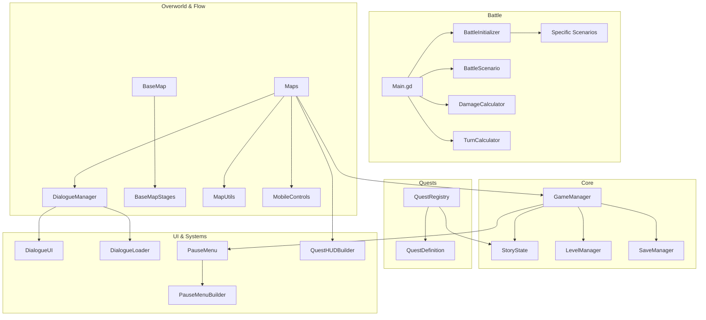

# SekaiRPG: Project Architecture & Dependency Map

Tài liệu này cung cấp cái nhìn tổng quan về kiến trúc của **SekaiRPG**, được thiết kế theo mô hình **Domain-Driven** và **Scenario-based**, giúp các lập trình viên dễ dàng mở rộng và bảo trì hệ thống.

---

## 1. Core Engine (Bộ não trung tâm)

Chịu trách nhiệm quản lý trạng thái toàn cục của trò chơi, bao gồm tiến trình cốt truyện, đội hình và dữ liệu lưu trữ.

| File | Chức năng chính | Phụ thuộc vào |
| :--- | :--- | :--- |
| **`GameManager.gd`** (Autoload) | Quản lý trạng thái toàn cục (Party, Scene Transition). Điều phối các `Scripted Battle`, bộ đếm Auto-save an toàn (5 phút), và xử lý Game Over. | `StoryState`, `LevelManager`, `SaveManager` |
| **`SaveManager.gd`** | Quản lý lưu trữ chuyên biệt tại `user://saves/`, tự động đóng gói siêu dữ liệu (Quest Name, Map Name, Timestamp, Version), quản lý Quick Save, Auto-Save, và các file save tự do không giới hạn. | `StoryState`, `QuestRegistry` |
| **`StoryState.gd`** | Lưu trữ các cờ (flags) kịch bản và tiến độ nhiệm vụ (wave, quest). | Không có |
| **`LevelManager.gd`** | Xử lý nhận EXP, tính toán chỉ số theo cấp độ (Soft/Hard Cap), và tự động phân bổ chỉ số (Auto-upgrade) cho quái vật. | `Entity` |

---

## 2. Battle System (Hệ thống chiến đấu)

Hệ thống chiến đấu theo lượt (Turn-based) phức tạp sử dụng cơ chế **Action Value (AV)** (tương tự Honkai: Star Rail).

### 2.1. Battle Engine (Lõi chiến đấu)
| File | Chức năng chính | Phụ thuộc vào |
| :--- | :--- | :--- |
| **`Main.gd`** | Battle Engine cốt lõi. Quản lý Vòng lặp lượt đánh, AI, Timeline (AV), và UI trận đấu. | Nhiều hệ thống |
| **`BattleInitializer.gd`** | Tự động đọc Map/Kịch bản để khởi tạo đội hình Phe ta - Phe địch và chọn Scenario phù hợp trước trận. | `GameManager`, `Scenarios` |
| **`AIManager.gd`** | Trí tuệ nhân tạo của kẻ địch. Tính toán mục tiêu (Tanker, Low HP) và ra quyết định dùng kỹ năng. | `Entity` |

### 2.2. Battle Mechanics (Cơ chế tính toán)
| File | Chức năng chính | Phụ thuộc vào |
| :--- | :--- | :--- |
| **`DamageCalculator.gd`** | Tính toán sát thương, bao gồm Buff, Debuff, và Tương khắc hệ (Cool, Pure, v.v.). | `Entity` |
| **`TurnCalculator.gd`** | Tính toán Action Value (AV) dựa trên Tốc độ (Speed) và hành động để xác định thứ tự lượt đánh. | `Entity` |
| **`ProcessStatus.gd`** | Xử lý logic tại đầu/cuối lượt (Trừ máu do Bleed/Poison, giảm Cooldown, Stun). | `Entity` |

### 2.3. Scenarios (Kịch bản chiến đấu)
Hệ thống sử dụng **Scenario Pattern** để can thiệp vào các "Hooks" của trận đấu (on_start, on_turn_start, on_entity_died). Nằm trong thư mục `BattleSystem/Scenarios/`.
| File | Chức năng chính |
| :--- | :--- |
| **`BattleScenario.gd`** | Lớp cơ sở (Abstract) định nghĩa các hooks chiến đấu. |
| **`DefaultScenario.gd`** | Logic chiến đấu mặc định (Đánh đến khi một bên hết máu). |
| **`HarborBossScenario.gd`**| Kịch bản phức tạp 3 Phase của trận Đội Trưởng (Cảng), hồi sinh, đổi team. |
| **`PrologueScenario.gd`** | Kịch bản trận mở màn (Ichika bị bao vây). |
| **`StreetSurvivalScenario.gd`** | Kịch bản sinh tồn đặc biệt: Khóa kỹ năng nhân vật, quái spawn vô hạn và tăng cấp dần theo lượt. Khi phe ta gục ngã, kích hoạt pha Cứu viện của Mafuyu (buff 50% chỉ số) và quản lý điều kiện diệt 10 tên Khủng Bố để chiến thắng. |

---

## 3. Dialogue System (Hệ thống hội thoại)

Tuân thủ chặt chẽ mô hình **MVC (Model-View-Controller)**, tách biệt hoàn toàn giữa dữ liệu, hiển thị và logic. Hỗ trợ hiển thị và tương tác rẽ nhánh cốt truyện (Branching Choices).

| File | Vai trò | Chức năng chính |
| :--- | :--- | :--- |
| **`DialogueManager.gd`** | **Controller** | Điều phối luồng thoại, block input, hiển thị lựa chọn (`show_choice`) và chờ trả kết quả (`choice_made`). |
| **`DialogueUI.gd`** | **View** | Vẽ giao diện khung thoại, chân dung NPC, tự động build UI nút lựa chọn (Choices). |
| **`DialogueLoader.gd`** | **Model** | Nạp và phân tích dữ liệu hội thoại từ bộ nhớ hoặc thư mục JSON. |

---

## 4. World & Maps (Hệ thống bản đồ)

Quản lý không gian Overworld và luồng di chuyển của người chơi. Các Map được tối ưu bằng `MapUtils.gd` để sử dụng chung logic vẽ gạch ngói, spawn NPC. 

| File/Thư mục | Chức năng chính | Trạng thái (Story) |
| :--- | :--- | :--- |
| **`MapUtils.gd`** | Tiện ích hỗ trợ tạo hình nền, vẽ tường, spawn nhân vật giảm thiểu lặp code. | Hệ thống phụ |
| **`PrologueMap.gd`** | Bản đồ mở đầu. Quản lý kịch bản Ichika bị bao vây và Mafuyu cứu viện. | Tutorial |
| **`BaseMap.gd`** (Shell)| Vỏ bọc Safehouse. Chứa BaseMapStage để thay đổi không gian (sáng/tối/buổi sáng). | Hub/Safehouse |
| **`WarehouseMap.gd`** | Bản đồ Nhà kho. Đánh theo dạng Wave liên tục. | Nhiệm vụ phụ |
| **`TrainingWarehouseMap.gd`** | Bản đồ Luyện tập/Sandbox. Tự động spawn địch theo thành viên tham gia, có cờ giới hạn (limit). | Luyện tập |
| **`CafeMap.gd`** | Bản đồ trang trí Quán Cafe. Cảnh hội thoại và phân nhánh kết cục sự kiện Ena say xỉn. | Nhiệm vụ phụ |
| **`HarborMap.gd`** | Bản đồ Bến cảng. Quản lý đường đi (Đánh lính gác hoặc vào thẳng Boss). | Nhiệm vụ chính |
| **`AlleywayMap.gd`** | Bản đồ Hẻm nhỏ. Trạm dừng chân và hội thoại sau khi đánh Boss. | Transition |
| **`StreetMap.gd`** | Bản đồ Đường phố ngã tư đô thị. Dàn dựng bối cảnh xe cộ, trận phục kích, sinh tồn và pha cứu viện của Mafuyu. | Nhiệm vụ chính |
| **`HonamiHouseMap.gd`** | Bản đồ Phòng khám tư nhân của Honami. Cung cấp Free Roam và tính năng Luyện tập với Honami. | Hub phụ |
| **`CityOperationsMap.gd`** | Bản đồ chiến dịch của tổ chức phòng vệ, tự động tạo background Hẻm/Đường/Cảng để phục vụ chiến dịch chia cắt của Kanade, Ichika, Honami. | Sự kiện cuối |
| **`HighwayMap.gd`** | Bản đồ xa lộ đêm. Kịch bản tẩu thoát trên xe và trận Boss cuối. | Sự kiện cuối |

---

## 5. Quests & Missions (Hệ thống Nhiệm vụ & Siêu dữ liệu)

Để tổ chức codebase theo hướng dễ tra cứu và bảo trì theo nhiệm vụ (Quest-driven) thay vì chỉ theo địa điểm vật lý, hệ thống cung cấp lớp siêu dữ liệu (Metadata Resource) tại thư mục `res://Quests/`.

| File / Thư mục | Chức năng chính | Phụ thuộc vào |
| :--- | :--- | :--- |
| **`QuestDefinition.gd`** | Lớp Resource định nghĩa cấu trúc dữ liệu cho một nhiệm vụ: ID, Tên, Arc, Scene bản đồ liên kết, Entry Stage, Scenario chiến đấu, Dialogue file, và điều kiện StoryState trước/sau. | `Resource` |
| **`QuestRegistry.gd`** | Tiện ích tĩnh cung cấp API nạp và tra cứu danh sách toàn bộ nhiệm vụ (`get_all_quests`), tra cứu theo ID (`get_quest`), và tự động xác định nhiệm vụ hiện tại dựa trên cờ StoryState (`get_current_quest`). | `QuestDefinition`, `StoryState` |
| **`Quests/Definitions/*.tres`** | 10 tài nguyên Resource tương ứng với 10 nhiệm vụ cốt truyện từ Prologue đến Finale. | `QuestDefinition` |

### Bảng Mapping 10 Nhiệm Vụ (Quests)

| Quest ID | Tên Nhiệm Vụ | Chương (Arc) | Map Scene Liên Kết | Safehouse Stage | Battle Scenario | Dialogue Files Chính |
| :--- | :--- | :--- | :--- | :--- | :--- | :--- |
| **`quest_01_prologue`** | Mở màn: Cuộc giải cứu Ichika | Prologue | `res://Maps/Prologue/PrologueMap.tscn` | N/A | `PrologueScenario` | `prologue.json` |
| **`quest_02_safehouse_intro`** | Căn cứ Nightcord & Nhận nhiệm vụ Kho | Safehouse Hub | `res://Maps/Base/BaseMap.tscn` | `IntroStage.gd` | Không có | `safehouse_intro.json` |
| **`quest_03_warehouse`** | Dọn dẹp Nhà Kho Bỏ Hoang | Mid-game (Phụ) | `res://Maps/Warehouse/WarehouseMap.tscn` | `IntroStage.gd` → `PostWarehouseStage.gd` | `DefaultScenario` | `warehouse.json` |
| **`quest_04_post_warehouse`** | Nghỉ ngơi & Mở khóa Cảng | Safehouse Hub | `res://Maps/Base/BaseMap.tscn` | `PostWarehouseStage.gd` | `DefaultScenario` (Training) | `safehouse_post_warehouse.json` |
| **`quest_05_harbor`** | Thâm nhập Bến Cảng & Boss Đội Trưởng | Mid-game (Chính) | `res://Maps/Harbor/HarborMap.tscn` | `PostWarehouseStage.gd` → `PostHarborStage.gd` | `HarborBossScenario` `DefaultScenario` | `harbor.json` `post_harbor.json` |
| **`quest_06_post_harbor`** | Báo cáo Bến Cảng & Mizuki vs Mafuyu | Safehouse Hub | `res://Maps/Base/BaseMap.tscn` | `PostHarborStage.gd` | `ScriptedBattleScenario` | `post_harbor.json` |
| **`quest_07_morning_cafe`** | Buổi sáng hỗn loạn & Sự kiện Quán Cafe | Character Arc | `res://Maps/Cafe/CafeMap.tscn` | `PostHarborMorningStage.gd` | `ScriptedBattleScenario` | `post_harbor_morning.json` `cafe_sequence.json` |
| **`quest_08_street_ambush`** | Phục kích Ngã tư & Cuộc chiến Sinh tồn | Main Quest | `res://Maps/Street/StreetMap.tscn` | `PostCafeStreetMissionStage.gd` | `StreetSurvivalScenario` `DefaultScenario` | `lobby_street_mission.json` `street_sequence.json` |
| **`quest_09_honami_clinic`** | Căn cứ bị đột kích & Phòng khám Honami | Safehouse / Hub 2 | `res://Maps/HonamiHouse/HonamiHouseMap.tscn` | `PostStreetStage.gd` → `HonamiHouseUnlockedStage.gd` | `DefaultScenario` (Training) | `base_honami_invasion.json` `honami_house.json` |
| **`quest_10_finale`** | Chiến dịch Thủ Tướng & Trận chiến Xa Lộ | Finale Arc | `res://Maps/Highway/HighwayMap.tscn` | `HonamiHouseUnlockedStage.gd` → `FinaleStage.gd` | `PrimeMinisterBossScenario` `ScriptedBattleScenario` | `defense_agency_ops.json` `pm_boss_aftermath.json` |

---

## 6. Entities (Thực thể & Chỉ số)

Thiết kế theo mô hình Hướng đối tượng (OOP). Mỗi nhân vật hoặc kẻ địch kế thừa từ một Base Class thống nhất. Tận dụng tính đa hình (Polymorphism) để tải ảnh thông qua `get_portrait_path()`.

### 6.1. Base Class
| File | Chức năng chính |
| :--- | :--- |
| **`Entity.gd`** | Nền tảng của vạn vật. Quản lý Stats (HP, ATK, SPD, DEF), Mảng Kỹ năng (Skills), Buffs/Debuffs (Status), và Hệ (Elements). Tích hợp logic nhận diện ảnh chân dung `get_portrait_path()`. |

### 6.2. Characters (Phe ta)
Các script nằm trong `Entities/Characters/`. Mỗi nhân vật (Ichika, Mafuyu, Ena, Mizuki, Kanade, Honami) có kỹ năng, chỉ số Hard Cap và cơ chế tương tác (Synergy) riêng biệt. Lớp nhân vật giờ đây tự động định tuyến đường dẫn Avatar UI của mình.

### 6.3. Enemies (Kẻ địch)
Các script nằm trong `Entities/Enemies/`.
*   **`Kidnapper.gd`**: Kẻ thù cơ bản ở Prologue.
*   **`Guard.gd` / `Captain.gd`**: Lính gác và Boss Đội trưởng tại Bến cảng.
*   **`WarehouseWorker.gd`**: Quái vật ở Nhà kho.
*   **`TrainingBot.gd`**: Dùng cho chế độ Sandbox/Training.
*   **`Thug.gd`**: Kẻ địch giang hồ xuất hiện tại Quán Cafe (CafeMap).
*   **`Terrorist.gd`**: Kẻ địch khủng bố xuất hiện tại khu vực Ngã tư đường phố (StreetMap) trong pha phục kích và sinh tồn, có kỹ năng xả súng liên thanh gây Bleed.
*   **`PrimeMinister.gd`**: Trùm cuối siêu mạnh (12000 HP), có kỹ năng Lệnh Bắn Tỉa (AOE) và Khóa Quyền Bính (Stun), cơ chế gọi đệ.

---

## 7. UI & Common Systems (Hệ thống UI & Hỗ trợ)

Quản lý các giao diện hỗ trợ tương tác người chơi, thiết kế dựa trên các lớp Builder để tránh nhồi nhét logic vào file trung tâm.

| File | Vai trò | Chức năng chính |
| :--- | :--- | :--- |
| **`MobileControls.gd`** (Autoload) | **Mobile Controller** | Tạo joystick ảo, các nút bấm (Menu, Interact) có bao viền gỗ tinh tế. Tự động ẩn/hiện thông minh tùy thuộc vào scene. |
| **`PauseMenu.gd`** & **`PauseMenuBuilder.gd`** | **System Menu** | Menu tạm dừng tích hợp chỉnh âm lượng, Quick Save, truy cập Save/Load Menu, và tính năng Skip Battle. |
| **`SaveLoadMenu.gd`** | **Save/Load View** | Giao diện quản lý danh sách file save in-game (Kenney UI): tạo file mới, xem badge Quest/Map/Timestamp, Tải, Ghi đè, Xóa kèm pop-up xác nhận. |
| **`QuestHUDBuilder.gd`** | **UI Builder** | Lắp ráp bảng điều khiển hiển thị Quest tại các Map. |
| **`UpgradeUI.gd`** | **Upgrade View** | Giao diện nâng cấp thuộc tính, chỉ số cho nhân vật bằng tài nguyên thu thập được. |

---

## 8. Font & Theme System (Hệ thống Font & Theme)

SekaiRPG sử dụng hệ thống Font chữ phân lớp chuyên nghiệp để định hình phong cách đồ họa sang trọng và tăng khả năng tối ưu hóa trải nghiệm đọc của người chơi.

| Thành phần | Font chữ áp dụng | Mô tả & Cách hoạt động |
| :--- | :--- | :--- |
| **Global Theme** (`default_theme.tres`) | **`zhcn.ttf`** | Thiết lập làm Font mặc định cho toàn bộ dự án Godot. Mọi Node văn bản (`Label`, `RichTextLabel`...) nếu không ghi đè sẽ tự động sử dụng font này. |
| **Global Buttons** (`default_theme.tres`) | **`#9Slide03 AMPLESOFT MEDIUM.ttf`** | Thiết lập ghi đè lớp `Button` trong Global Theme để mọi nút bấm trong trò chơi tự động mang kiểu chữ đậm cá tính này. |
| **Title Banner** (`StartMenu.gd`) | **`zhcn.ttf`** | Dùng riêng cho tiêu đề trò chơi "SEKAI RPG" ở màn hình mở đầu. |
| **Dialogue Narration** (`DialogueUI.gd`) | **`#9Slide03 AMPLESOFT MEDIUM.ttf`** | Gán cho thuộc tính `normal_font` của RichTextLabel trong hộp hội thoại người dẫn chuyện (Narrator) và thoại chính. |
| **Dialogue Action** (`DialogueUI.gd`) | **`#9Slide03 AMPLESOFT MEDIUM.ttf`** | Tự động kích hoạt khi dùng thẻ `[i]` (thể hiện thoại hành động cốt truyện). |
| **Character Name** (`DialogueUI.gd`) | **`#9Slide03 AMPLESOFT MEDIUM.ttf`** | Tự động kích hoạt khi dùng thẻ `[b]` (bọc quanh tên nhân vật phát ngôn cốt truyện). |

---

## Sơ đồ phụ thuộc (Dependency Flow)

```mermaid
graph TD
    subgraph Core
        GM[GameManager] --> SS[StoryState]
        GM --> LM[LevelManager]
        GM --> SManager[SaveManager]
    end

    subgraph Quests
        QR[QuestRegistry] --> QD[QuestDefinition]
        QR --> SS
    end

    subgraph Battle
        M[Main.gd] --> BI[BattleInitializer]
        M --> BS[BattleScenario]
        M --> DC[DamageCalculator]
        M --> TC[TurnCalculator]
        BI --> SC[Specific Scenarios]
    end

    subgraph Overworld & Flow
        MAP[Maps] --> GM
        MAP --> DM[DialogueManager]
        BM[BaseMap] --> BSt[BaseMapStages]
        MAP --> MU[MapUtils]
        MAP --> MC[MobileControls]
    end

    subgraph UI & Systems
        DM --> DUI[DialogueUI]
        DM --> DL[DialogueLoader]
        GM --> PM[PauseMenu]
        PM --> PMB[PauseMenuBuilder]
        MAP --> QHB[QuestHUDBuilder]
    end
```

---

## Hướng dẫn mở rộng cho Developer

1.  **Thêm Nhân vật / Kẻ địch mới**:
    *   Tạo script mới kế thừa `Entity.gd` trong thư mục `Entities/Characters/` hoặc `Entities/Enemies/`.
    *   Định nghĩa Base Stats, Element và danh sách Kỹ năng (Skills array).
    *   Đăng ký Class mới vào từ điển `character_classes` hoặc `enemy_classes` trong `BattleInitializer.gd`.

2.  **Thêm Trận đánh Boss (Scripted Battle)**:
    *   Tạo file Scenario mới trong `BattleSystem/Scenarios/` (kế thừa `BattleScenario.gd` hoặc `DefaultScenario.gd`).
    *   Cập nhật `BattleInitializer.gd` (hàm `_setup_scripted_battle`) để trả về Scenario này cùng với đội hình tương ứng.
    *   Gọi `GameManager.is_scripted_battle = true` trước khi trigger trận.

3.  **Thêm Kịch bản tại Safehouse**:
    *   Tạo file Stage mới trong `Maps/Base/Stages/` (kế thừa `BaseMapStage`).
    *   Ghi đè các hàm như `get_npc_positions()`, `on_stage_start()` để đặt logic.
    *   Đăng ký Stage vào `BaseMap.gd`.

4.  **Thêm Nhiệm vụ (Quest) mới**:
    *   Tạo file tài nguyên `.tres` mới trong `res://Quests/Definitions/` kế thừa `QuestDefinition.gd`.
    *   Điền các trường: `quest_id`, `linked_map_scene`, `battle_scenario_class`, `dialogue_files`, `pre_conditions`, `post_conditions`.
    *   Đăng ký file vào hằng số `QUEST_FILES` trong `QuestRegistry.gd`.

---

## 9. Game Flow & State Transitions (Luồng chuyển cảnh)

Trò chơi sử dụng cấu trúc State Machine đơn giản do `GameManager` (Autoload) quản lý để chuyển đổi giữa bản đồ (Overworld) và trận đánh (BattleScene).

### 9.1. Kích hoạt trận đấu (Trigger Battle)
1. `GameManager.store_map_state()`: Lưu lại đường dẫn map hiện tại và vị trí người chơi.
2. Kích hoạt cờ tương ứng: `is_scripted_battle` (nếu là trận cốt truyện), `is_training_mode` (nếu là trận huấn luyện), hoặc không có (trận quét map thông thường).
3. `GameManager.trigger_battle()`: Gọi `get_tree().change_scene_to_file("res://BattleSystem/BattleScene.tscn")`.

### 9.2. Kết thúc trận đấu (Battle Completion)
Tại `Main.gd` (Battle Engine), khi trận đấu phân định thắng thua:
1. Gọi `scenario.get_victory_status()` để xác định kết quả (is_victory).
2. Gọi `scenario.on_battle_completed(main, is_victory)` để dọn dẹp và xử lý cốt truyện.

**LƯU Ý CỰC KỲ QUAN TRỌNG:**
- Nếu bạn tạo một Custom Scenario kế thừa trực tiếp từ `BattleScenario` (ví dụ `StreetSurvivalScenario`), **bạn BẮT BUỘC phải gọi `GameManager.finish_battle(is_victory, ...)`** ở cuối hàm `on_battle_completed`. Nếu không, game sẽ bị treo (đứng yên) tại giao diện chiến thắng do không có lệnh chuyển scene.
- Nếu kế thừa từ `DefaultScenario`, hàm `on_battle_completed` của nó đã gọi sẵn `GameManager.finish_battle()`.

### 9.3. Hậu trận đấu (Post-Battle)
1. `GameManager.finish_battle()` được gọi.
2. Cộng EXP, Cập nhật Quest/Wave dựa trên cờ thắng/thua.
3. Nếu thua (ở trận cốt truyện/map): Hồi máu đầy đủ và Dịch chuyển người chơi về Safehouse (`BaseMap.tscn`).
4. Chuyển scene: `get_tree().change_scene_to_file(current_map_file)`.

---

## 10. Tóm tắt Cốt truyện (Story Summary)

Tiến trình trò chơi được chia thành các chương (Arcs) chính, xoay quanh biệt đội Nightcord (Mafuyu, Kanade, Ena, Mizuki) và các nhân vật liên quan (Ichika, Honami):

### 9.1. Mở màn (Prologue)
- **Sự kiện:** Ichika bị bắt cóc bởi một đám côn đồ. Nightcord (dẫn đầu bởi Mafuyu) xuất hiện giải cứu kịp thời.
- **Bản đồ:** `PrologueMap` -> `BaseMap`.

### 9.2. Các nhiệm vụ phụ & Xây dựng căn cứ (Mid-game)
- **Nhà kho (Warehouse):** Nhóm dọn dẹp các đợt quái (công nhân biến chất) tại một nhà kho.
- **Quán Cafe (Cafe):** Ena say xỉn, gây ra một cuộc ẩu đả nhỏ với giang hồ (`Thug`).
- **Cảng (Harbor):** Nhóm thâm nhập bến cảng, tùy chọn đánh lính gác hoặc đối đầu trực tiếp với Boss Đội Trưởng (`Captain`).

### 9.3. Vòng vây đường phố (Street Ambush)
- **Sự kiện:** Ichika và Mizuki bị khủng bố (`Terrorist`) phục kích tại ngã tư. Bị vô hiệu hóa kỹ năng và ép vào đường cùng. Mafuyu xuất hiện ứng cứu, một mình dọn sạch vòng vây.
- **Bản đồ:** `StreetMap`.

### 9.4. Hồi Kết (Finale Arc: Chiến dịch Thủ Tướng)
- **Tiết lộ (Plot Reveal):** Mafuyu phát hiện cấp trên của mình (Thủ tướng) là kẻ giật dây khủng bố để ám sát Nightcord, đồng thời thuê chính họ làm vệ sĩ để tẩu thoát. Cô bí mật liên minh với Honami và lật ngược thế cờ.
- **Chiến dịch chia cắt (City Operations):** Kanade, Ichika, và Honami tỏa ra 3 hướng khác nhau để dẹp loạn khủng bố.
- **Trận chiến Xa lộ (Highway):** Mizuki hóa trang thành tài xế của Thủ tướng. Mafuyu và Ena lật bài ngửa ngay trên xe. Trận đánh Boss cuối cùng diễn ra.
- **Kết cục:** Thủ tướng bị Mafuyu hành quyết tàn nhẫn trước mặt Ichika. Nhóm Nightcord lui về ở ẩn tại phòng khám của Honami. Bộ trưởng Quốc phòng lên thay thế và bưng bít vụ việc.
